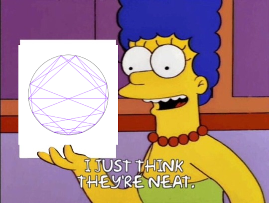

# fibonnaci-art

I saw this [YouTube Video about visualizing Fibonacci numbers](https://youtu.be/o1eLKODSCqw) and I thought the designs were really neat.

I also wanted to learn some go since it's also neat.
When I found  [fogleman's gg 2d rendering library in go](https://github.com/fogleman/gg) that was that.

Origin story complete.

TODO:
* Make an actual cli application
* Some other things also
